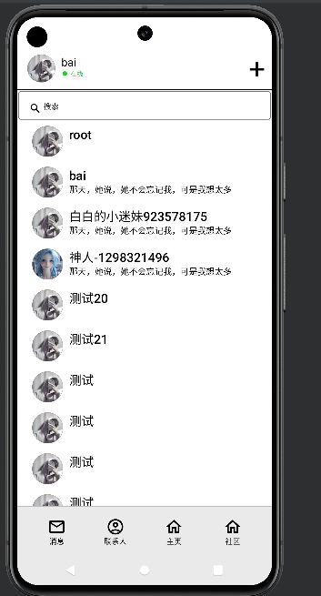

# fileEntity-android

#### 介绍

本项目是一个仿QQ的IM系统，采用了compose实现了基本UI组件，该踩过的雷都踩了，主要功能是社交通讯，及一些系统工具，游戏工具。
很多功能还在待开发中。

本项目属于前台项目，后台是dispatch-sdk，rpc中台，后续会分离出dispatch-app-server

### 技术栈
本项目偏向国产化
```
UI: compose material3
Server: socket.d snack3
data: room
```

## 下面是基本功能与页面，大部分完成，游戏在开发中

### 消息


#### 消息详情


### 联系人



### 游戏


### 社区
