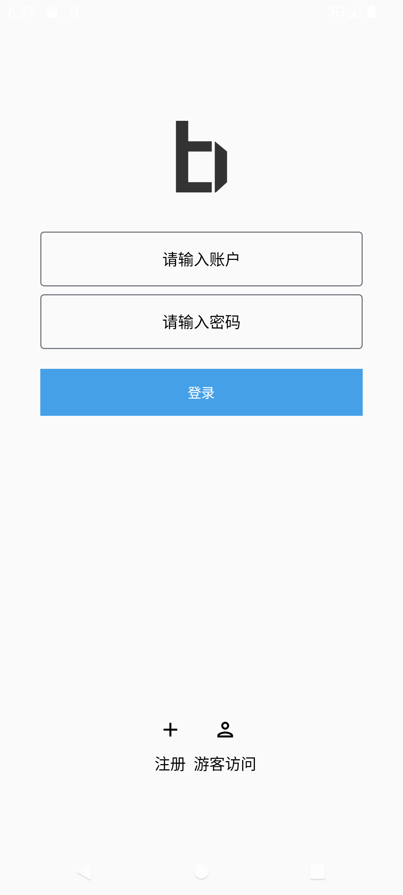
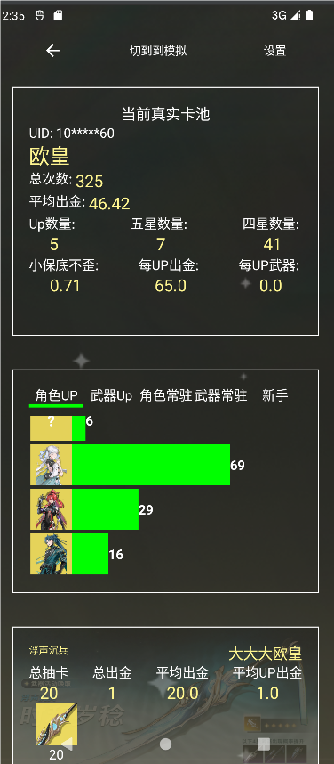

# B-Im


#### 介绍

本项目是一个仿QQ的IM系统，采用了compose实现了基本UI组件，该踩过的雷都踩了，主要功能是社交通讯，及一些系统工具，游戏工具。
抽卡模拟，分析，统计
很多功能还在待开发中。

本项目属于客户端项目，后台是dispatch-sdk，rpc中台，后续会分离出dispatch-app-server


24-green" alt="material-3-green" />

如何有任何建议和能技术支持的同学欢迎加群

<a target="_blank" href="https://qm.qq.com/cgi-bin/qm/qr?k=u5b9H-KYtVZ1AkWNj4a_QVhzaGpxZxAn&jump_from=webapi&authKey=1FnsQITgER4fNmkupjQ2SOmHwJkxO7ePsSfBbmr6AzRTWRkxi3dKUbNCQQRYTeFE"></a>

下载地址 ：https://rs.loserbai.cn/public

### 技术栈
本项目偏向国产化
```
UI: compose material3
Server: socket.d snack3
data: room
```


## 更新预告
- 铁道 全部兼容
- 原神 全部兼容
- 角色强度榜
- 社区动态发布


### 后续
- 图库管理
- 表情包管理
- 好友管理

## 下面是基本功能与页面，完成功能中大部分属于基础功能完成，细节待优化
- 基础功能
- - 个人资料 （完成）
- - 联系人 （完成）
- - 实时通讯 （待完成）
- - - 消息发送 （完成）
- - - 图片发送 （未完成）
- - 动态 （完成）
- 鸣潮
- - 抽卡模拟器（已完成）
- - 抽奖分析 （已完成）
- - 练度统计 （未兼容）
- 原神
- - 抽卡模拟器（未兼容）
- - 抽奖分析 （未兼容）
- - 练度统计 （未兼容）
- 铁道
- - 抽卡模拟器（已完成）
- - 抽奖分析 （未开始）
- - 练度统计 （未兼容）
- 绝区零
- - 抽卡模拟器（已完成）
- - 抽奖分析 （已完成）
- - 练度统计 （未兼容）




### 消息
自动监听接受消息，并获取未读数量


#### 消息详情


### 联系人


### 游戏
提供了几款游戏支持，将官网于wiki直接引入到程序中


#### 抽卡分析



#### 抽卡模拟


### 社区
